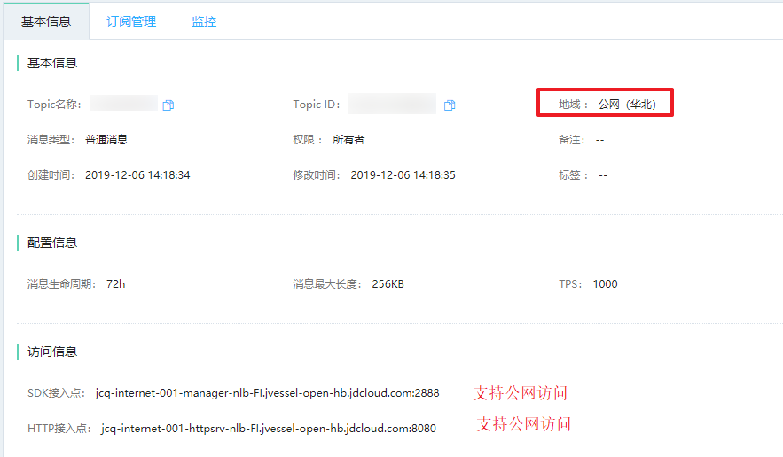
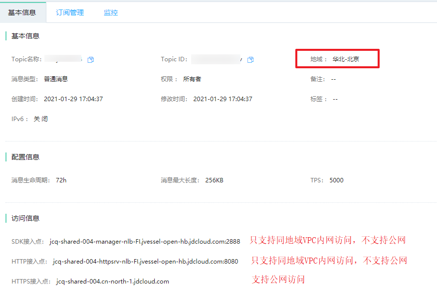
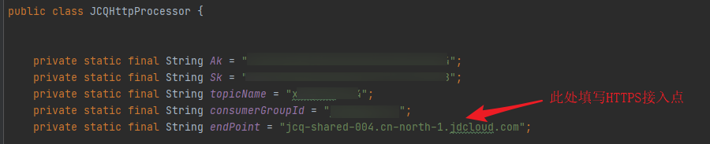
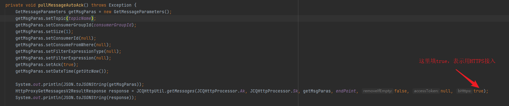
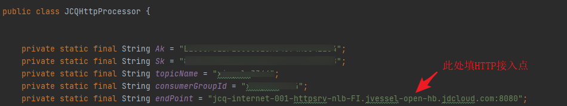
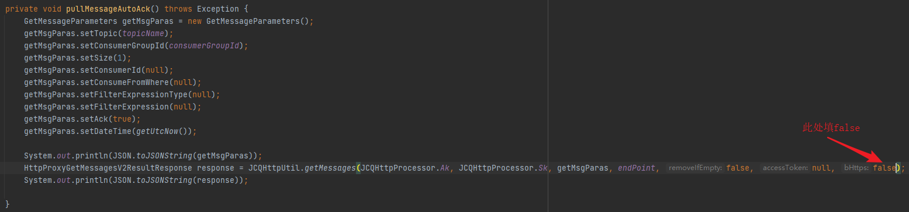
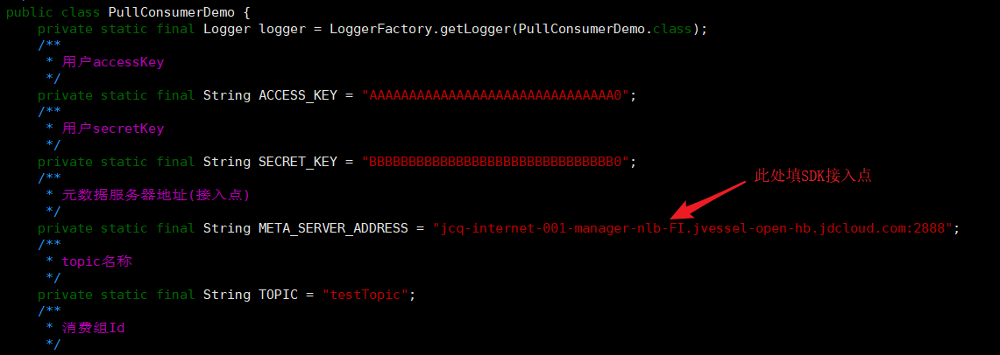
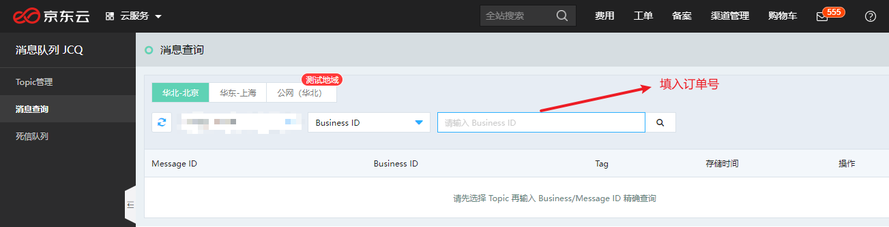
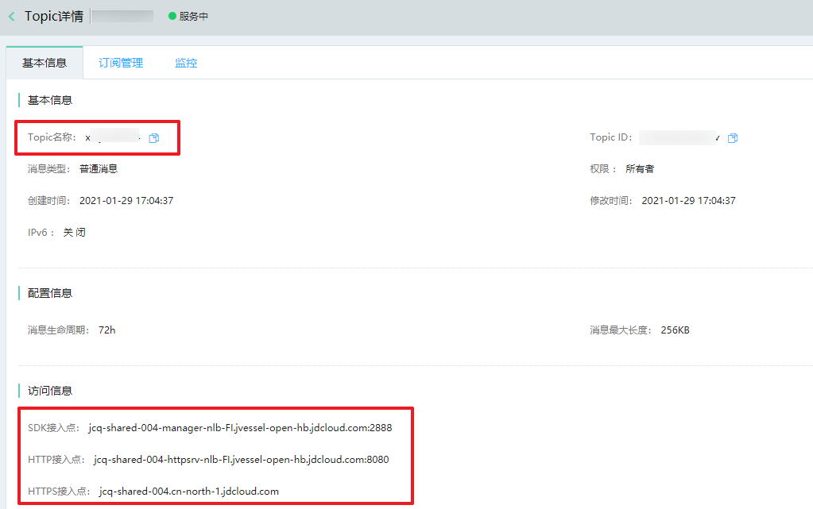

## 一、JCQ如何通过公网访问

### 1.1 公有云topic

1. 使用公网（华北）的topic，支持==SDK==公网接入和==HTTP==公网接入(该topic不建议生产使用)。

   

2. 使用华北-北京的JCQ，支持HTTPS公网接入。

   

### 1.2 云鼎

云鼎JCQ==不支持公网访问==，只能通过和topic同地域的京东云云主机内网访问。

## 二、JCQ 是否有调用示例

示例地址: https://docs.jdcloud.com/cn/message-queue/demo

> 注意！！！如果以重启进程方式拉取消息(例如使用linux的计划任务定时拉取)，每次拉取一条消息，则都会拉同一个partition，若此partition无消息则会一直拉不到，建议将拉取逻辑放到循环里，在进程内循环拉取。

### 2.1 公网连接topic demo示例

**华北-北京HTTPS接入**





**公网(华北)HTTP接入** 





**公网(华北)SDK接入**



## 三、拉取不到消息

### 3.1 通常有如下几个原因

1. topic中没有消息，或者发送方没有发送消息。
2. 如果用户消费时带了tag，则会开启tag过滤规则，过滤没有此tag的消息。消费时代码里不要带tag，或者填写正确的tag。tag功能参考：https://docs.jdcloud.com/cn/message-queue/produce-and-consume-message
3. 如果用户以重启进程方式拉取，每次拉取一条消息，都会拉同一个partition，若此partition无消息则会一直拉不到。建议将拉取逻辑放到循环里，在进程内循环拉取。循环拉取过程中，会出现一会儿能拉到数据，一会儿拉不到，属于正常情况。

### 3.2 如何判断消息是否进入topic

1. 联系消息发送方，确认消息是否成功发送，消息成功发送会返回messageId，每一条消息都有独立的messageId，可以和消息发送方进行确认。

2. 如果是开普勒、云交易、宙斯的用户，可以根据订单号，查询消息是否进入topic，步骤如下：

   (1) 登录京东云控制台(https://jcq-console.jdcloud.com/topics)，消息队列JCQ - 消息查询。如果用的是云鼎，请登录云鼎控制台

   (2) 选择地域、topic、Business ID，填入==订单号==，点击查询。如果查询不到消息，请联系下业务方确认消息是否正常发送。

   

3. 只能查询到==消息生命周期3天以内==的消息，3天之前的消息，请联系业务方进行确认。

4. 消息查询更详细使用方式参考：https://docs.jdcloud.com/cn/message-queue/query-message

## 四、访问topic常见报错

### 4.1 连接超时

```
exception:[com.jcloud.jcq.communication.exception.CommunicationException: ChannelFuture has been completed, but the channel localAddress: , remoteAddress:  is still not active!]
```

该报错是因为网络不通，通常有如下几种原因: 

1. 没有在和topic同地域的京东云VPC环境下连接jcq
2. 在同地域云VPC环境下，但是云主机的安全组、子网关联的ACL没有放行相应网段。

如果需要公网连接jcq，请参考第一节

### 4.2 SDK报错

```
The heart beat service for the channel localAddress: 10.0.0.3:44452, remoteAddress: 100.72.13.171:2888 has already been shutdown
```

该报错是客户端重新拉取路由，属于正常情况

### 4.3 报错topic不存在

1. 确认ak/sk填写正确。ak/sk从https://uc.jdcloud.com/account/accesskey获取

2. 确认代码中填入的是topic名称，而不是topic id

3. 确认代码中填入的接入点和topic名称，在控制台topic详情里是对应的。

   

### 4.4 报错订阅不存在

消费日志中报错`subscription not exist`，通常有以下两种原因:
1. topic下没有此订阅
2. 订阅的创建者是子账号A，但是代码中使用的ak/sk，不是该子账号的ak/sk
  建议是哪个账号创建的订阅，就用哪个账号的ak/sk来进行消费。

### 4.5 常见返回错误码

使用http/https方式拉取消息，常见错误码：https://docs.jdcloud.com/cn/message-queue/response-result

### 4.6 如何判断消费签名是否正确

使用工具：https://github.com/xinyulu3344/jcqsign。该工具会返回签名计算过程中排序后的key、signSource和最终的签名

